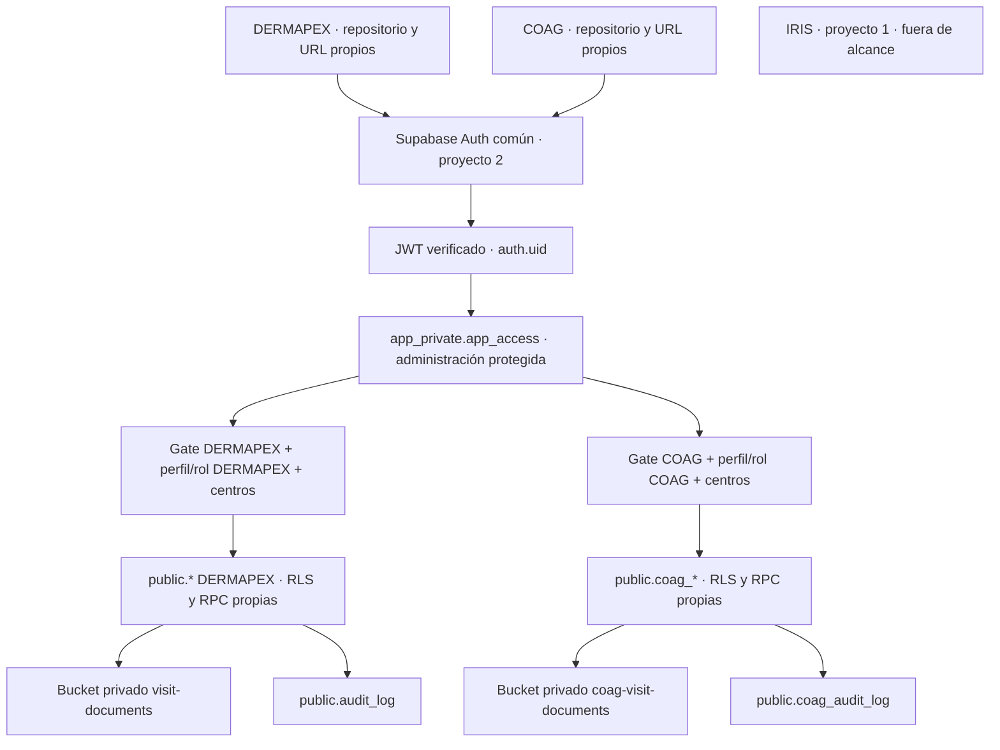

# DERMAPEX y COAGULOPATÍAS en un único proyecto Supabase

Documento de análisis y diseño · 7 de octubre de 2026.

**Estado: propuesta, sin implementación.** Referencia analizada: checkout DERMAPEX, commit `c1694e424bda084e488fb0e3d03c0621fb799196`. No se ha consultado el proyecto Supabase real, ejecutado migraciones ni cambiado código, Auth, RLS o Storage en esta fase. IRIS queda completamente fuera del alcance. Los nombres `coag_*` son conceptuales; no constituyen un modelo clínico aprobado.

## 1. Resumen ejecutivo

**Recomendación única: arquitectura D, concretada mediante separación C de los datos**: Auth físico común, autorización explícita por aplicación en una tabla privada mínima, DERMAPEX conservado en sus tablas actuales de `public`, y COAG con tablas `public.coag_*`, funciones privadas propias y bucket privado propio. No se añaden `study_id` a las tablas clínicas existentes, no se mueven tablas ni se convierte DERMAPEX en una plataforma multiestudio.

El prefijo ayuda a organizar; **no autoriza ni aísla por sí mismo**. La seguridad procede de privilegios SQL, RLS, funciones con comprobaciones explícitas, relaciones limitadas al estudio y políticas de Storage. La misma URL y la misma clave pública podrán emplearse desde ambas aplicaciones sin representar una frontera de seguridad.

La principal condición previa es corregir el significado de «usuario DERMAPEX»: hoy todo usuario nuevo de Auth obtiene automáticamente un perfil DERMAPEX activo. Un usuario sin centro no ve pacientes, pero sí puede leer determinados catálogos y efectuar algunas escrituras de referencia. Por tanto, añadir solo tablas COAG no satisface la independencia solicitada.

El diseño exige un endurecimiento acotado de autorización DERMAPEX antes de admitir cuentas COAG: pertenencia explícita, incorporación del control a los helpers centrales y una barrera restrictiva en sus tablas accesibles. También exige revisar las rutas privilegiadas que no quedan protegidas automáticamente por RLS. Las políticas clínicas existentes siguen determinando el acceso por centro y las reglas CMO.

**Veredicto: GO WITH CONDITIONS para el diseño; NO-GO para incorporar usuarios o datos COAG al proyecto actual hasta superar las condiciones de la sección 21.** Si se exige independencia de identidad, claves administrativas, recuperación o averías, compartir este proyecto deja de ser una opción válida y se necesitan proyectos físicos independientes.

## 2. Arquitectura actual DERMAPEX

### 2.1 Evidencia del repositorio

| Área | Evidencia | Comportamiento relevante |
|---|---|---|
| Frontend | `src/lib/supabase.ts`, `src/services/*`, `src/lib/authLinks.ts` | React/TypeScript/Vite; consultas a nombres de `public`; Auth por contraseña y gestión explícita de enlaces |
| Identidad y control | `20261005100000_dermapex_foundation.sql` | `profiles`, `centers`, `center_memberships`, `audit_log`; trigger de alta sobre `auth.users` |
| Núcleo | `20261005100100_dermapex_clinical_core.sql` | Pacientes seudonimizados, consentimientos, visitas, puntuaciones, intervenciones, cuestionarios y documentos |
| Medicación | `20261005100200_dermapex_medication_module.sql` | Catálogos normalizados, medicación longitudinal y eventos por visita |
| Autorización | `20261005100300_dermapex_rls.sql` | Helpers `app_private`, RLS por centro; coordinación transversal solo dentro del modelo DERMAPEX |
| Documentos | `20261005100400_dermapex_storage.sql` | Bucket privado `visit-documents`, PDFs con ruta `visits/<visit_id>/<archivo>.pdf` |
| Contraseña inicial | `20261005120000_dermapex_force_password_change.sql` | `must_change_password`, RPC `mark_password_changed()` |
| Cohortes y CMO | Migraciones `20261006100000`, `20261006100100`, `20261006100200`, `20261006100300` | Cohortes por centro, modelo versionado, RPC de guardado, vistas con enmascarado y catálogo de intervenciones |
| Evolución posterior | `20261006120000`, `20261006130000` y migraciones `20261007*` | Retirada de proceso, códigos DPX, batería de cuestionarios, prohibición de estratificar en brazo estándar, atención habitual, DLQI y EVASAF |
| Validación existente | `db-tests/*`, `tests/*`, `e2e/*`, `.github/workflows/ci.yml` | Pruebas de integridad/RLS locales, Vitest y smoke con stack local; no acreditan aún aislamiento entre estudios |

El README y ciertos comentarios iniciales describen una fase anterior. Para esta propuesta prima la secuencia completa de migraciones: por ejemplo, `visit_process_records` se elimina y la cohorte estándar ya no puede guardar estratificación. No se presupone que todos esos cambios estén desplegados: **REQUIERE VERIFICACIÓN EN SUPABASE**.

### 2.2 Autorización actual

- `profiles.id` referencia a `auth.users.id`; rol `investigator` por defecto e `is_active = true`.
- `handle_new_auth_user()` crea un perfil para cualquier alta Auth. El backfill original también incluye todos los usuarios Auth existentes. `raw_user_meta_data.full_name` solo se utiliza como nombre; no se ha identificado autorización basada en ese dato editable.
- `is_active_user()` solo comprueba el perfil activo. `is_coordinator()` añade el rol de ese perfil.
- `can_access_center()` acepta coordinación o pertenencia a centro con perfil activo; paciente y visita delegan en ese helper.
- Las políticas de perfil permiten lectura propia y coordinación, y alta propia limitada por privilegios de columna. El rol y la actividad no son editables por el navegador.
- Los catálogos de variables, modelos, cuestionarios y medicamentos tienen vías basadas en `is_active_user()`, sin exigir centro. Parte de los catálogos de medicación permite alta o actualización a cualquier perfil activo.
- RLS se activa con `ENABLE`, no `FORCE`. Las funciones de propietario pueden superar RLS; necesitan autorización en su cuerpo o una cadena segura de helpers.
- `can_access_center()` no exige actualmente `centers.is_active`. El default de centro sí filtra centros activos. No se cambia esta semántica clínica en este diseño; COAG debe definir expresamente su propia semántica de desactivación.

### 2.3 Límites de lo observado

El repositorio prueba intención y evolución, no configuración efectiva. Exposición de schemas, grants y privilegios por defecto, propietarios, roles con `BYPASSRLS`, estado de buckets, otras políticas, funciones desplegadas, Realtime y configuración Auth: **REQUIERE VERIFICACIÓN EN SUPABASE**. Los resultados de onboarding anteriores no equivalen a ejecutar los nuevos tests de aislamiento; en esta fase solo se diseñan.

## 3. Elementos DERMAPEX que no deberían tocarse

Conservar nombres y ubicación de tablas, columnas clínicas, UUID, códigos DPX, relaciones existentes, funciones de cálculo, cohortes, batería de cuestionarios, rutas React, servicios, dashboards, informes y exportaciones. Mantener el bucket `visit-documents` y su contrato de rutas. No compartir sus catálogos ni registros con COAG, aunque algunos datos farmacológicos sean públicos.

No reescribir migraciones históricas, renombrar `app_private`, trasladar a `dermapex.*`, añadir `study_id`, copiar datos a tablas unificadas ni reinterpretar el rol DERMAPEX como rol global. Conservar el comportamiento permitido de los usuarios DERMAPEX autorizados; demostrarlo mediante regresión.

La excepción futura indispensable será el control de aplicación y la revisión puntual de superficies privilegiadas. Esta excepción se propone aquí, no se ejecuta. Si se prohíbe cualquier cambio de autorización DERMAPEX incluso en una fase posterior, el veredicto para compartir proyecto es NO-GO.

## 4. Riesgos actuales al compartir el proyecto

| Hallazgo comprobado en código | Consecuencia | Tratamiento de diseño |
|---|---|---|
| Alta Auth genera perfil DERMAPEX activo | Una cuenta COAG adquiriría lectura/escritura de ciertos catálogos DERMAPEX | Autorización explícita, independiente de la existencia del perfil |
| Perfil propio insertable con `id, full_name` | Dejar de crear perfiles automáticamente no basta: el cliente podría crear el suyo con valores por defecto | Barrera de aplicación que el cliente no puede asignarse |
| Coordinación y actividad solo miran `profiles` | Cualquier error administrativo de rol repercute en DERMAPEX | Exigir pertenencia DERMAPEX en los helpers y validar altas/roles |
| Vistas CMO usan privilegios del propietario | Una barrera RLS de tabla aislada no protege sus resultados | Mantener sus filtros, verificando que el helper incorpora la autorización de aplicación |
| `visit_study_arm(uuid)` devuelve cohorte sin control de acceso y tiene EXECUTE para `authenticated` | Puede revelar cohorte por UUID a quien pueda invocarla; exposición HTTP no demostrada | Retirar EXECUTE directo del rol cliente si no es necesario; conservar uso interno por funciones propietarias |
| `mark_password_changed()` solo filtra `auth.uid()` | Una cuenta COAG podría modificar su perfil DERMAPEX automático; el RPC no acredita un cambio real de contraseña | Exigir autorización DERMAPEX; documentar el límite del indicador |
| Grants/revokes históricos sobre todas las tablas de `public` | Reejecutarlos tras añadir COAG puede alterar permisos de ambas aplicaciones | No reproducir migraciones históricas; operaciones nuevas con objetos explícitos |
| Auth, administración y recursos físicos comunes | Sesiones válidas para ambas APIs; cambios globales, límites o incidentes afectan a ambos | Roles por aplicación, despliegue gobernado y aceptación del riesgo común |
| Edge Function CIMA no comprueba pertenencia en su cuerpo | Validar JWT en gateway, si está habilitado, no autoriza a DERMAPEX | Verificar configuración desplegada y añadir autorización de aplicación si se mantiene como endpoint DERMAPEX |

No se afirma que exista actualmente una fuga de pacientes a usuarios sin centro ni que `app_private` esté expuesto vía REST. Sí existen premisas incompatibles con añadir COAG sin adaptar autorización. Una política permisiva amplia añadida a `storage.objects` puede abrir ambos buckets, aunque las actuales sean correctas; hay que inspeccionar el conjunto efectivo.

## 5. Comparación A/B/C/D

D es una dimensión de autorización que puede combinarse con distintas separaciones físicas de tablas. Para elegir una arquitectura concreta se comparan A, B, C sin capa explícita y D con tablas prefijadas.

| Criterio | A: tablas comunes con `study_id` | B: `dermapex.*` y `coagulopatias.*` | C: DERMAPEX intacto + `public.coag_*` | D recomendada: Auth común + acceso explícito + `coag_*` |
|---|---|---|---|---|
| Seguridad y aislamiento | Posible, pero cada FK, consulta, RPC y política debe preservar el estudio | Buen orden de namespaces; requiere RLS igualmente | Posible con políticas correctas; Auth actual deja exposición DERMAPEX | Fuerte frente a clientes, con barrera de aplicación y ámbito de centro |
| Riesgo DERMAPEX | Alto: migración transversal de datos y lógica | Alto al mover DERMAPEX y cambiar sus consultas | Bajo en tablas clínicas; insuficiente sin adaptación Auth | Bajo/medio, acotado a autorización y regresión |
| Complejidad | Alta por modelo común y claves compuestas | Media/alta por traslado, grants y exposición de schemas | Baja de organización; mantenimiento duplicado | Media por control explícito, sin clínica común |
| RLS | Filtro de estudio en todas las rutas, riesgo de omisión | Una familia por schema; schemas no separan `authenticated` | Una familia por estudio; prefijos no separan roles SQL | Familia propia y requisito explícito de app en ambas |
| Data API/PostgREST | Un API y tablas polimórficas | Configurar schemas expuestos y selección del cliente | Contrato `public` existente, endpoints separados por nombre | Igual que C; cambiar endpoint no permite cambiar autorización |
| Storage | Buckets y control por `study_id` coherente | Buckets por app; el schema clínico no aísla Storage | Buckets por app | Buckets por app y helpers de autorización independientes |
| Auth | Común; aún necesita acceso por app | Común; el schema no crea tenant Auth | Común; trigger actual incompatible con independencia estricta | Común, autorización protegida separada de identidad |
| Migraciones | Cambios extensos y backfill | Mover tablas, revisar funciones y dependencias | Mayormente aditivas | Aditivas más endurecimiento pequeño obligatorio |
| GitHub Pages | Compatible | Compatible; cliente elige schema | Compatible | Compatible; sesiones diferenciadas en nuevo frontend |
| Desarrollo COAG | Dependiente del modelo compartido | Autónomo tras preparar namespaces | Autónomo | Autónomo en clínica y roles |
| Exposición cruzada | Fallo de filtro puede mezclar filas reales | Grants/funciones mal configurados pueden cruzar schemas | Políticas o helpers copiados pueden cruzar tablas | Se reduce con barrera restrictiva y pruebas negativas de todos los caminos |
| Estudios futuros | Fácil nominalmente, exige plataforma genérica | Ordenado, requiere alta de schemas | Nuevos prefijos y familias repetidas | Nueva entrada de acceso y familia independiente, sin SaaS |
| Deuda técnica | Alta unificación prematura | Coste de traslado innecesario ahora | Prefijos y repetición, manejables con pocos estudios | Repetición controlada y catálogo explícito de superficies |

B tiene una variante viable de menor riesgo: conservar DERMAPEX en `public` y crear solo `coagulopatias.*`. Mejora la organización, pero añade exposición/grants de schema y selección del cliente sin aportar identidad Auth separada ni protección automática. No se descarta para un futuro; ahora no ofrece suficiente beneficio frente a C con la capa D para justificar más configuración compartida. La recomendación no se basa en considerar los prefijos más seguros que los schemas.

## 6. Arquitectura recomendada

1. Un solo `auth.users` en el proyecto 2; identidades distintas para cada comunidad, sin pertenencias simultáneas en el alcance actual.
2. Tabla privada `app_private.app_access` que representa autorización administrativa explícita, inicialmente a `dermapex` o `coag`.
3. Roles independientes: `public.profiles.role` para DERMAPEX y `public.coag_profiles.role` para COAG. La tabla de acceso no duplica roles.
4. Datos y catálogos clínicos separados; ninguna FK COAG apunta a tablas clínicas, centros, perfiles o catálogos DERMAPEX.
5. Helpers COAG en `coag_private`; jamás reutilizar `app_private.is_coordinator()` para decidir privilegios COAG.
6. Buckets y auditorías separados; los servicios/exportaciones solo leen la familia propia.
7. Ningún secreto administrativo en GitHub Pages. Los procesos de administración son explícitos y ajenos al navegador.

La autorización se calcula como **identidad verificada + acceso activo a la aplicación + perfil activo de esa aplicación + rol/centro apropiado + relación válida del recurso**. Elegir una app en React, enviar un encabezado `app_id`, conocer un UUID o presentar la clave pública no satisface esa fórmula.

## 7. Diagrama lógico

Los frontends pueden intentar llamar cualquier endpoint del proyecto; el diagrama muestra caminos autorizados, no separación impuesta por las URLs. IRIS no tiene relación, conexión o migración propuesta.

## 8. Diseño Auth

### 8.1 Identidad común, permisos independientes

Auth emitirá JWT del mismo proyecto. Un usuario DERMAPEX podría autenticarse desde la página COAG con sus credenciales, pero COAG debe rechazar su autorización y su API devolverle cero datos protegidos. No es posible convertir dos interfaces en dos servidores Auth independientes dentro del mismo proyecto mediante claves públicas distintas.

Alta recomendada: el administrador crea la identidad, provisiona perfil propio, acceso de aplicación y centros en una operación administrativa revisada. No hay autoasignación por URL de registro, correo, dominio ni `user_metadata`. Un alta fallida deja usuario autenticable sin autorización clínica; nunca concede permisos provisionales. Mantener cerrado el registro público si ese es el flujo aprobado: **REQUIERE VERIFICACIÓN EN SUPABASE**.

No eliminar usuarios Auth para revocar solo una aplicación; revocar acceso y perfil preservando trazabilidad. El borrado Auth es una operación global, con FK/cascadas/restricciones potenciales de ambos estudios. Una misma dirección de correo normalmente identifica una sola cuenta en el tenant Auth; flujos y proveedores concretos: **REQUIERE VERIFICACIÓN EN SUPABASE**. Si una persona necesitara dos identidades independientes con el mismo correo, resolver primero ese requisito, sin duplicaciones artificiales ni concesión dual automática.

### 8.2 Sesiones y GitHub Pages

Dos sitios GitHub Pages bajo `ramonmorillo.github.io` comparten origen aunque tengan rutas distintas. La separación de repositorios o rutas no separa `localStorage`; el cliente actual no configura un `storageKey` propio. COAG deberá usar su propio `auth.storageKey` y comprobar autorización antes de mostrar contenido. Esto evita colisiones accidentales de sesión, no es una defensa frente a scripts maliciosos del mismo origen. Para independencia frente a compromiso de frontend, recomendar **orígenes distintos**, por ejemplo dominios/subdominios distintos; GitHub Pages los admite. No hace falta cambiar la URL DERMAPEX para que el nuevo COAG tenga otro origen.

Site URL, redirects, proveedores, plantillas, SMTP, política de contraseña, MFA, sesiones y límites son compartidos. Supabase puede admitir varias URLs autorizadas, pero solo una Site URL por proyecto: **REQUIERE VERIFICACIÓN EN SUPABASE**. Añadir el callback COAG sin sustituir los DERMAPEX. Mantener la gestión de fragmentos del HashRouter existente; diseñar COAG con un callback propio y redirecciones exactas. CORS no sustituye autorización.

`must_change_password` actual es una barrera de interfaz: `mark_password_changed()` puede invocarse sin demostrar un cambio Auth. No afirmar que bloquea Data API hasta renovar contraseña. Si eso fuera un requisito de seguridad obligatorio, necesitaría diseño adicional de verificación del lado servidor, como tarea separada, antes del GO.

## 9. Diseño de autorización por aplicación

### 9.1 Tabla mínima conceptual

`app_private.app_access`:

| Campo/restricción | Propósito |
|---|---|
| `user_id uuid` como PK, FK a `auth.users` | Una identidad se autoriza a una sola app en este alcance; no comparte investigadores |
| `app_code text` con CHECK de códigos aprobados | Inicialmente `dermapex` y `coag`; no es un valor libre suministrado por el cliente |
| `is_active boolean`, por defecto falso | Denegar hasta activación administrativa explícita |
| `created_at`, `updated_at`, `assigned_by` administrativo | Trazabilidad del alta/cambio de autorización |

No hace falta `app_registry` ahora: dos códigos controlados y una tabla bastan. Para un tercer estudio se amplía deliberadamente el CHECK y se añade su familia de datos. Si más adelante se permiten identidades con acceso a varias apps, revisar primero la regla y tests; entonces PK compuesta `(user_id, app_code)`, sin convertir roles clínicos en globales.

No conceder al navegador SELECT general ni INSERT/UPDATE/DELETE en esta tabla; activar RLS sin políticas cliente, revisar propietario/grants y mantenerla fuera de los schemas expuestos. `has_app_access(app_code)` comprueba siempre `auth.uid()` y fila activa. `SECURITY DEFINER` mínimo, `search_path = ''`, nombres cualificados y sin argumentos para sustituir al usuario. EXECUTE solo cuando sea necesario para políticas y funciones. El booleano no revela la pertenencia de terceros.

Roles siguen en perfiles protegidos de cada aplicación; evitar `app_access.role`, `app_metadata.role` y perfil como tres fuentes de verdad. `app_metadata`, aunque no sea editable por el usuario, puede quedar obsoleto hasta renovar JWT: no se necesita aquí. La consulta a DB hace efectiva la revocación en la siguiente operación autorizada, con excepciones de transacciones ya iniciadas y URLs firmadas descritas después.

### 9.2 Compatibilidad y provisión

La primera población de `app_access` exige inventario administrativo de usuarios DERMAPEX válidos, incluidos coordinadores y personas pendientes de centro. No usar «todo Auth», «todo perfil activo» ni solo «quien tiene centro» como criterio automático. Cuentas de prueba o inactivas deben clasificarse. El backfill y activación deben ser transaccionales con el endurecimiento para evitar dejar a investigadores válidos bloqueados.

Mantener temporalmente el trigger que crea perfiles DERMAPEX evita cambiar el flujo actual; esos perfiles automáticos **no otorgan pertenencia** y quedarán invisibles e inoperantes para cuentas COAG por el gate. No usarlos para informes de participantes sin aplicar la autorización. El trigger produce un registro mínimo en la auditoría DERMAPEX para cada nueva identidad: hay que cerrar esa contaminación de auditoría, como se detalla en la sección 12. Dejar de crear perfiles DERMAPEX automáticos es una limpieza posterior recomendable, no la frontera de seguridad; requeriría sustituir el alta por provisión explícita y revisar el flujo administrativo existente.

Las altas futuras DERMAPEX necesitan un paso administrativo nuevo para activar acceso. No existe una inferencia segura de app a partir del mero INSERT en `auth.users`.

## 10. Diseño RLS

### 10.1 Barrera DERMAPEX de aplicación

Proponer controles complementarios:

- Incorporar `has_app_access('dermapex')` a `is_active_user()`, `is_coordinator()`, `can_access_center()` y `has_cmo_center_access()`. Este último contiene una rama propia de pertenencias y no queda cubierto solo cambiando `is_active_user()`.
- `can_access_patient()` y `can_access_visit()` heredan la barrera a través de `can_access_center()`. Mantener relaciones y semántica clínica actuales.
- Añadir una política **AS RESTRICTIVE**, para todos los comandos del rol `authenticated`, con `USING` y `WITH CHECK` de acceso DERMAPEX a cada tabla DERMAPEX expuesta. Debe incluir perfiles, pertenencias, catálogos, modelos y auditoría, además de clínica; usar un inventario explícito, no «todas las tablas de public» tras crear COAG.
- No añadir un gate como política permisiva: las políticas permisivas se combinan con OR y podrían ampliar acceso. Las restrictivas se combinan por AND con las permisivas existentes; no conceden derechos por sí mismas.

El inventario incluye tablas actuales de foundation, core, medicación, modelos e intervenciones/atención habitual. `patient_code_counters` mantiene su denegación explícita; no se le conceden derechos por añadir gates. No incluir la tabla ya eliminada `visit_process_records`. Futuras tablas DERMAPEX deben incorporarse al inventario de seguridad antes de otorgar grants.

La barrera restrictiva evita que la lectura/alta del perfil propio u otra política aislada se conviertan en acceso a DERMAPEX. Los helpers son indispensables para vistas propietarias, RPC y Storage donde el gate de tabla no basta. No aplicar una política restrictiva DERMAPEX incondicional a todo `storage.objects`, porque impediría el uso legítimo del bucket COAG.

### 10.2 Reglas COAG

Helpers conceptuales de `coag_private`: `is_active_user()`, `is_coordinator()`, `can_access_center(uuid)`, `can_access_patient(uuid)`, `can_access_visit(uuid)`. Todos requieren acceso COAG; solo consultan tablas COAG. Definir que centro inactivo impide nuevas altas/escrituras, conservando lectura histórica según protocolo aprobado; la definición final de acceso tras cierre: **REQUIERE VERIFICACIÓN EN SUPABASE** y aprobación funcional antes de implementación.

| Recurso | SELECT | INSERT / UPDATE | DELETE |
|---|---|---|---|
| `coag_profiles` | Perfil propio autorizado; coordinación COAG sobre perfiles COAG autorizados | Campos de presentación propios; rol, actividad y acceso solo administración protegida | Sin borrado por cliente |
| `coag_centers` | Centros propios; coordinación COAG todos los COAG | Coordinación COAG | Coordinación si integridad/protocolo lo permite |
| `coag_center_memberships` | Propias y coordinación COAG | Coordinación COAG, comprobando usuario con acceso COAG | Coordinación COAG con auditoría |
| `coag_patients` | Centro autorizado o coordinación COAG | Centro autorizado, paciente seudonimizado, autor sellado | Coordinación; preferir cierre lógico según protocolo |
| `coag_visits`, `coag_consents`, `coag_treatments` | Acceso al paciente COAG padre | `USING` sobre fila antigua y `WITH CHECK` sobre nueva | Coordinación según protocolo |
| Cuestionarios e intervenciones COAG | Acceso a la visita COAG padre | Acceso a visita y validación de catálogo/modelo COAG | Coordinación según protocolo |
| Catálogos COAG | Acceso COAG activo | Coordinación COAG salvo excepción justificada por flujo | Según integridad y retención |
| `coag_visit_documents` | Acceso a visita COAG | Alta validada y autor real; sin edición de ruta/parent desde cliente | Autor permitido o coordinación, siempre con acceso a visita |
| `coag_audit_log` | Solo coordinación COAG | Solo triggers/procesos internos, nunca cliente | Ningún rol cliente |

Una pertenencia a aplicación sin centro no permite pacientes a un investigador. Un coordinador COAG activo puede ver todos los centros COAG, nunca DERMAPEX. Un perfil coordinador sin acceso activo a su aplicación no tiene privilegios.

### 10.3 Integridad y cambios de ownership

RLS no sustituye FK ni reglas de identidad. Cada FK COAG debe referenciar exclusivamente su familia: paciente→centro COAG, visita→paciente COAG, respuesta/intervención→visita COAG, autor→perfil COAG. Si una fila almacena a la vez visita y paciente, garantizar coherencia con clave compuesta o trigger seguro. También validar que el perfil de una pertenencia esté autorizado a COAG, no solo que exista una FK.

Sellar `created_by`, `uploaded_by` y autoría de modificaciones con `auth.uid()`, e impedir su edición. Mantener inmutables IDs, centro del paciente y enlaces padre desde endpoints generales. `USING` + `WITH CHECK` evita mover a centros inaccesibles, pero **no impide por sí solo** mover a otro centro también autorizado; esa operación requiere prohibición por columna/trigger, o un flujo administrativo específico, auditado y aprobado. No proponer un traslado de pacientes entre estudios.

### 10.4 Funciones privilegiadas DERMAPEX: inventario y tratamiento

Todas las funciones `SECURITY DEFINER` encontradas declaran `search_path = ''`, lo que reduce ataques por resolución de nombres. Aun así, los grants efectivos, propietarios y posibles sobrecargas desplegadas son **REQUIERE VERIFICACIÓN EN SUPABASE**.

| Función o grupo | Evaluación del código y decisión futura |
|---|---|
| `is_active_user`, `is_coordinator`, `can_access_center` | Raíz de permisos DERMAPEX; añadir gate explícito |
| `can_access_patient`, `can_access_visit` | Consultan solo DERMAPEX y delegan en centro; verificar denegación heredada |
| `has_cmo_center_access` | Tiene consulta propia de memberships; necesita gate además del de coordinación |
| `visit_study_arm` | Devuelve dato sin autorización y EXECUTE cliente; retirar EXECUTE directo, mantener llamada interna, verificar dependencias reales |
| `can_view_cmo_results` | Comprueba visita antes de cohorte; hereda gate de visita y conserva enmascarado |
| `public.save_cmo_stratification` | Ya exige usuario activo y acceso a visita; con helpers endurecidos debe rechazar COAG antes de tocar datos; mantener cálculo clínico |
| `public.mark_password_changed` | Añadir comprobación de pertenencia DERMAPEX; solo actualiza fila del usuario, no verifica cambio Auth |
| `handle_new_auth_user` | Inserta perfil en DERMAPEX para todas las altas; no considerarlo autorización, revisar provisión y auditoría |
| `write_audit_log` | Resuelve relaciones e inserta siempre en auditoría DERMAPEX; nunca conectar a tablas COAG; aislar eventos de perfiles no autorizados |
| `default_patient_center` | Consulta memberships DERMAPEX, invocación por trigger; barrera de INSERT y gate final impiden altas COAG; no exponer como RPC |
| `enforce_center_study_arm`, `enforce_patient_center_has_arm` | Triggers clínicos sobre tablas DERMAPEX; preservar, sin reutilizarlos en COAG |
| `enforce_intervention_rules` | Revisar la definición final de atención habitual, que reemplaza a la anterior; solo DERMAPEX |
| `enforce_cmo_score_arm` | Trigger que impide CMO en estándar, incluso por RPC; preservar |
| `enforce_center_study_number`, `assign_patient_study_code` | Código DPX y contador DERMAPEX; solo triggers, conservar denegación del contador |
| `can_delete_document_object` | No autoriza visita por sí sola; política actual también exige `can_access_visit`. Mantener esa conjunción y bucket exacto |

`set_updated_at`, `stamp_actor_column`, `visit_id_from_document_path`, `enforce_model_immutability`, `derive_intervention_min_level`, `enforce_medication_event_patient_match`, `enforce_item_result_visit_match` y `set_questionnaire_response_code` no son `SECURITY DEFINER` en sus definiciones inspeccionadas. Revisar grants y contexto de ejecución igualmente. `enforce_visit_patient_match` se elimina junto al módulo proceso; no tratarlo como función vigente.

Las vistas `cmo_stratification_registry` y `cmo_stratification_item_values` usan `security_barrier` y filtro explícito `can_access_visit`; no son `security_invoker`. `security_barrier` no implica aplicar la RLS del llamador. Mantener el comportamiento de cohortes y comprobar el gate a través de esos filtros, sin cambiar vistas a invoker a ciegas porque podría romper la lectura prevista del brazo estándar.

COAG debe preferir RPC `SECURITY INVOKER` y vistas `security_invoker` cuando sea suficiente. Si necesita definer, exigir gate COAG, identidad `auth.uid()`, autorización del recurso y validación de parámetros antes de cualquier lectura/escritura privilegiada. Revocar EXECUTE de PUBLIC/anon en cada nueva firma, conceder solo las necesarias, sin SQL dinámico de nombres recibidos del cliente. Los privilegios de propietario, `service_role` y `BYPASSRLS` siguen fuera de la protección RLS; no atribuirles aislamiento automático.

## 11. Diseño Storage

Mantener `visit-documents` y crear **bucket privado `coag-visit-documents`**. Dos buckets son más claros que carpetas de estudio dentro de uno; permiten permisos y límites distintos, y evitan que un error de extracción del primer segmento cambie de estudio. No constituyen aislamiento por sí solos: `storage.objects` es común.

Rutas COAG: `visits/<coag_visit_id>/<object_uuid>.pdf`, asociadas a `coag_visit_documents`. Cada política COAG debe exigir bucket exacto, acceso COAG activo, ruta válida y visita COAG accesible. SELECT para listado/descarga/firma; INSERT con `WITH CHECK`; DELETE con autor/rol y visita; no permitir UPDATE/upsert por defecto. Si se introduce sobrescritura, diseñar tanto fila antigua como nueva y restringir bucket/ruta.

Para DERMAPEX, los helpers endurecidos cierran acceso de COAG a su bucket sin cambiar nombres o rutas. Revisar **todas** las políticas de `storage.objects`, incluidas las añadidas manualmente: una permisiva general puede anular la intención de las específicas. Una defensa restrictiva adicional, si se adopta, debe ser condicional por bucket y compatible con ambas aplicaciones, nunca gate DERMAPEX global.

Las URLs firmadas son capacidades transferibles: una URL ya emitida puede seguir funcionando hasta caducar aunque se revoque membership. Recomendar expiración corta, no registrarlas en auditorías/logs ni exportarlas, y probar caducidad. No prometer revocación instantánea de una URL ya firmada. Verificar límites, MIME, carácter privado, comportamiento efectivo de firma y rutas de upload resumible: **REQUIERE VERIFICACIÓN EN SUPABASE**. El rollback de metadatos/objetos debe estar documentado; no suponer transacción conjunta entre Postgres y Storage.

## 12. Diseño de auditoría

Recomendar logs independientes: conservar `public.audit_log` y crear `public.coag_audit_log`. Un log con `app_id` ahorraría una tabla, pero incorporaría payloads de ambos estudios y aumentaría la necesidad de filtrado privilegiado y el riesgo en exportaciones. No ofrece beneficio suficiente aquí.

El logger COAG debe resolver centro/paciente/visita únicamente desde tablas COAG, registrar autor, operación, entidad, timestamp y payload mínimo aprobado. No adjuntar el logger DERMAPEX a tablas COAG: usa nombres y joins DERMAPEX. Coordinar retención y minimización para evitar duplicar datos sensibles innecesariamente. Sin DML cliente sobre logs; grants de secuencias explícitos donde sean necesarios. La auditoría no es inmutable frente a administradores del proyecto ni captura por sí sola lecturas o descargas.

**Excepción importante al enfoque puramente aditivo:** el trigger Auth actual crea perfiles DERMAPEX y el trigger de perfiles los audita. El gate de lectura clínica no evita que un coordinador DERMAPEX vea esos eventos de cuentas COAG. Antes de incorporar COAG debe acotarse la auditoría DERMAPEX de perfiles y pertenencias a usuarios con autorización DERMAPEX. Guardar los eventos de alta/revocación de `app_access` en un log administrativo privado separado, no visible a coordinadores clínicos de ningún estudio. Si el perfil se crea antes de asignar app, registrar esa provisión en el log privado; no atribuirla automáticamente al estudio. Validar también UPDATE/DELETE y revocaciones, evitando perder historial DERMAPEX previamente legítimo. No ocultar silenciosamente registros históricos: clasificar los anteriores antes del lanzamiento, sin borrado masivo.

La alternativa posterior de dejar de crear perfiles automáticos de otras aplicaciones elimina esa contaminación en origen, pero modifica el flujo de altas. Elegirla solo tras demostrar regresión; el control explícito sigue siendo obligatorio.

## 13. Arquitectura propuesta COAG

Repositorio y frontend nuevos, con versiones y despliegue independientes. El nuevo frontend consulta únicamente nombres `coag_*` y RPC `coag_*`, usa storageKey propio y comprueba autorización de aplicación. No importar services ni motores clínicos DERMAPEX sin análisis separado del protocolo.

Familia conceptual mínima:

- Control: `coag_profiles`, `coag_centers`, `coag_center_memberships`.
- Clínica: `coag_patients`, `coag_consents`, `coag_visits`.
- Instrumentos: `coag_questionnaire_catalog`, `coag_questionnaire_responses`.
- Tratamientos e intervenciones: `coag_treatments`, `coag_intervention_catalog`, `coag_interventions`.
- Documentos y trazabilidad: `coag_visit_documents`, `coag_audit_log`.
- Funciones de autorización/trigger en `coag_private`; RPC públicas específicas solo cuando las requiera el flujo.

No sembrar variables, diagnósticos, cuestionarios, puntuaciones, calendarios o intervenciones por analogía con dermatitis atópica. El protocolo COAG define esos contratos antes de implementar. Exportaciones y dashboards COAG solo usan datos COAG; mantener seudonimización y correspondencia de identidades fuera de la aplicación según el protocolo. No crear joins, vistas o informes combinados entre estudios.

## 14. Cambios mínimos necesarios en DERMAPEX

La clasificación siguiente distingue cambios futuros imprescindibles para aislamiento de mejoras que pueden esperar. **Ninguno se ejecuta en esta fase.**

| Cambio propuesto | Motivo | Riesgo | Impacto DERMAPEX | Impacto COAG | Complejidad | Carácter |
|---|---|---|---|---|---|---|
| Gate en cuatro helpers raíz identificados | Cerrar pacientes, catálogos, CMO, RPC y Storage | Bloquear usuarios si falta backfill | Mantiene reglas; exige autorización explícita | No hereda permisos DERMAPEX | Media | Imprescindible |
| Políticas restrictivas aditivas en inventario DERMAPEX | Cubrir perfil propio y ramas no centralizadas | Omitir tabla o usar política permisiva por error | Cambia solo acceso de no autorizados | Impide lectura/alta en DERMAPEX | Media | Imprescindible |
| Acotar `mark_password_changed` a DERMAPEX | Evitar escritura cruzada en perfil | Denegar cuentas mal provisionadas | Firma y flujo legítimo conservados | No modifica DERMAPEX | Baja | Imprescindible |
| Retirar invocación cliente de `visit_study_arm` tras verificar dependencias | Evitar oráculo de cohorte por UUID | Dependencia externa no documentada | Mantiene ejecución interna clínica | No obtiene dato de DERMAPEX | Baja/media | Imprescindible cerrar la superficie |
| Aislar auditoría de perfiles no DERMAPEX | Evitar exposición de investigadores/eventos COAG | Perder trazabilidad si se filtra sin log administrativo | Auditoría clínica conserva su ámbito | Identidades no aparecen en log DERMAPEX | Media | Imprescindible |
| Ajustar procedimiento administrativo de altas | Auth no equivale a autorización | Error de clasificación o asignación | Un paso explícito adicional | Alta independiente | Media | Imprescindible |
| Autorizar endpoint CIMA como DERMAPEX | JWT del proyecto no identifica aplicación | Cambio de endpoint puede interrumpir búsqueda | Mantener contrato y comportamiento autorizado | Endpoint propio si lo necesita | Media | Imprescindible si sigue siendo exclusivo DERMAPEX |
| Eliminar después perfiles automáticos ajenos | Evitar artefactos y carga innecesaria | Romper provisión actual | Nuevo flujo explícito de perfiles | Sin perfil DERMAPEX residual | Media | Recomendable, tras regresión |
| Origen web COAG diferente y storageKey propio | Evitar colisiones y acceso de scripts del mismo origen | Configuración DNS/callback | Puede conservar su URL actual | Sesión y origen propios | Baja/media | storageKey imprescindible si comparte origen; origen distinto recomendable, obligatorio si se exige resistencia a compromiso del otro frontend |

No se propone modificar cálculo, permisos clínicos legítimos, nombres de servicios ni rutas DERMAPEX. Las dos vistas CMO requieren pruebas, no una sustitución automática. La barrera de app no autoriza a coordinadores COAG a ninguna operación DERMAPEX, ni viceversa.

## 15. Nuevos elementos necesarios en Supabase

| Elemento/cambio | Motivo | Riesgo | Impacto DERMAPEX | Impacto COAG | Complejidad | Carácter |
|---|---|---|---|---|---|---|
| `app_private.app_access` y helper mínimo | Fuente segura de autorización | Escalada si se permite DML cliente | Gate adicional | Alta explícita | Media | Imprescindible |
| Log administrativo privado | Trazar provisión sin mezclar investigadores | Exposición de identidades si se publica | Sin acceso clínico al log global | Igual | Media | Imprescindible |
| Tablas/constraints/índices `coag_*` | Modelo independiente | FK mal dirigida o clínica no aprobada | Sin cambios estructurales | Modelo propio | Media/alta según protocolo | Imprescindible |
| `coag_private` y helpers propios | Roles y centros COAG | Definer mal autorizado | No modifica `app_private` clínico | Autorización por centro | Media | Imprescindible |
| RLS y grants COAG por objeto | Denegar cliente no autorizado | Grants amplios/defaults inesperados | Sin grants globales | API controlada | Media | Imprescindible |
| Bucket privado COAG y políticas específicas | Documentos aislados | Política permisiva general o URL larga | Bucket existente preservado | Documentos propios | Media | Imprescindible si hay documentos |
| Auditoría/trigger COAG propios | Trazabilidad independiente | Payload excesivo o mutación administrativa | Log existente preservado | Log propio | Media | Imprescindible |
| Callbacks COAG en Auth | Invitación/recuperación propia | Sustituir redirects actuales | Añadir sin eliminar existentes | Login completo | Baja/media | Imprescindible |
| Edge Functions COAG con autorización explícita | Evitar uso de endpoints privilegiados cruzados | Uso indebido de service_role | No reutilizar endpoints clínicos | Solo funciones requeridas | Media | Condicional a necesidades COAG |
| Inventario de Realtime y publicación | Cubrir caminos adicionales a REST | Publicación/filtrado incorrecto | Preservar sus suscripciones | Suscripciones propias o deshabilitadas | Media | Imprescindible verificar; activación opcional |
| Presupuesto de recursos y backups recuperables | Continuidad en infraestructura común | Saturación o restauración conjunta | Comparte capacidad e incidentes | Igual | Media | Imprescindible |

Los secretos administrativos se guardan solo en entorno servidor aprobado. Revocar EXECUTE por defecto sobre funciones nuevas y conceder firmas concretas. Revisar privilegios por defecto del rol que migra sin revocar indiscriminadamente objetos existentes. `public` expuesto no significa todas las tablas autorizadas: grants y RLS deben revisarse conjuntamente. Si `app_private` u otro schema privado estuviera expuesto, retirarlo solo tras evaluar dependencias: **REQUIERE VERIFICACIÓN EN SUPABASE**.

## 16. Estrategia de migraciones aditivas

Solo plan para una fase posterior expresamente autorizada. Un único proyecto físico necesita **un historial canónico de migraciones**: mantener el historial existente DERMAPEX como autoridad del proyecto por ahora, incorporar allí migraciones COAG revisadas, y evitar que el segundo repositorio ejecute un `db push` independiente con una historia divergente. El repo COAG contiene su frontend y referencia la versión de contrato backend; CI prueba ambos contra el historial canónico. Una futura ubicación neutral de infraestructura es posible, no necesaria ahora.

| Fase | Acción y condición de salida | Protección DERMAPEX |
|---|---|---|
| 0. Backup y comprobaciones | Inventariar estado desplegado, Auth, grants, funciones, políticas, buckets y recursos; exportar DB y objetos; probar restauración | No asumir que dump SQL incluye archivos Storage ni toda configuración Auth |
| 1. Autorización | Crear acceso privado y log administrativo; clasificar usuarios; backfill; activar gates, restricción de perfiles/auditoría y RPC | Cambios de DB en transacción cuando sea posible; nadie COAG admitido todavía; regresión DERMAPEX obligatoria |
| 2. Infraestructura COAG | Crear tablas, constraints y helpers privados; nombres exclusivos; sin datos reales | Crear RLS antes de grants, o en la misma transacción, para no abrir una ventana de acceso |
| 3. RLS COAG | Políticas por acción, grants mínimos y firmas RPC concretas | Probar usuarios COAG también contra todos los endpoints DERMAPEX |
| 4. Storage COAG | Bucket privado, rutas, metadatos y políticas | Revisar unión efectiva de políticas de ambos buckets; verificar firma y subida real |
| 5. Tests de aislamiento | Matriz completa SQL + REST + RPC + Storage + navegadores en entorno desechable | Regresión clínica DERMAPEX y pruebas de revocación; cero exposición inesperada |
| 6. Frontend COAG | Conectar app nueva, callbacks y origen/sesión; pilotos solo con datos ficticios | Repetir login/recuperación DERMAPEX y operaciones representativas tras cambios globales |

Los tests deben diseñarse desde la fase 1 y acompañar cada fase; la fase 5 es la puerta final, no la primera vez que se prueba seguridad. Cada fase requiere validación de DERMAPEX antes de avanzar. Las operaciones externas/Auth/Storage no comparten automáticamente una transacción con DDL; desplegar en orden que falle cerrado, con procedimiento de reversión.

Versiones, migraciones realmente aplicadas, mecanismos de backup disponibles en el plan gratuito, restaurabilidad de Auth/configuración y capacidad actual: **REQUIERE VERIFICACIÓN EN SUPABASE**. No ejecutar nada contra IRIS ni usar sus credenciales como sustituto.

## 17. Tests de aislamiento obligatorios

**Diseñados, no ejecutados en esta fase.** Fixtures totalmente ficticias, dos centros por app y usuarios: investigador D1/D2, coordinador D, investigador C1/C2, coordinador C, autenticado sin acceso, acceso revocado, perfil inactivo y anon. Cada investigador pertenece solo a su aplicación. Incluir UUID idénticos deliberadamente entre tablas de apps distintas para demostrar que la seguridad no depende de improbabilidad de colisión.

Los tests SQL cambian al rol `authenticated` y simulan claims solo en DB local; no ejecutar como propietario/service_role y llamarlo validación RLS. Los tests HTTP usan JWT reales del stack aislado, anon/publishable key real del entorno de prueba y clientes independientes. Validar éxitos autorizados antes de negativos para descartar pruebas que pasan porque toda la app está rota.

| # | Prueba | Resultado exigido |
|---|---|---|
| 1 | Investigador/coordinador DERMAPEX consultan `coag_patients` | Cero filas protegidas, nunca un paciente COAG |
| 2 | Investigador/coordinador COAG consultan `patients` | Cero filas protegidas, nunca paciente DERMAPEX |
| 3 | Investigador DERMAPEX consulta centros COAG | Cero centros COAG |
| 4 | Investigador COAG consulta centros DERMAPEX | Cero centros DERMAPEX |
| 5 | Coordinador DERMAPEX intenta leer, crear, editar o borrar en COAG | Denegación en toda familia COAG, incluidos catálogos y auditoría |
| 6 | Coordinador COAG intenta lo equivalente en DERMAPEX | Denegación en tablas, vistas, RPC y Storage DERMAPEX |
| 7 | UUID ajeno conocido o coincidente, filtros exactos e IDs en URL | Ningún dato/acción por conocer el identificador |
| 8 | Manipular endpoint, payload, centro, usuario, headers de schema/app | Permisos proceden de identidad y DB; ninguna ampliación |
| 9 | Data API directa sin frontend, joins embebidos, counts, vistas y exportaciones | Mismo aislamiento; sin datos incrustados ni counts clínicos ajenos |
| 10 | JWT COAG sobre bucket DERMAPEX | Denegar listado, descarga, firma, upload, sobrescritura y borrado |
| 11 | JWT DERMAPEX sobre bucket COAG | Igual, en ambas direcciones y con rutas válidas/UUID conocidos |
| 12 | Enumerar y llamar todas las firmas RPC accesibles | Sin bypass; `save_cmo_stratification` y `mark_password_changed` rechazan COAG; helper de cohorte no invocable por cliente |
| 13 | Autenticado sin acceso, aunque tenga perfil activo o antiguo membership de centro | Sin datos clínicos, catálogos privados, centros, audit logs ni documentos de ninguna app |
| 14 | Anon y clave pública sin sesión | Sin lectura ni escritura clínica de ambas apps; probar RPC y Storage también |
| 15 | INSERT/UPDATE/UPSERT/PATCH cambian autor, centro o parent a otro estudio/centro | Rechazo o cero filas afectadas, sin mutación indirecta ni acceso posterior |

Ampliaciones necesarias para cubrir los hallazgos del repo:

- COAG intenta leer/crear/editar `profiles`, `center_memberships`, modelos, `medication_catalog`, `med_catalog_*` y demás catálogos DERMAPEX. No debe poder autoasignarse acceso mediante un perfil creado por sí mismo.
- Usuario recién creado por Auth: sin `app_access` no tiene acceso; tras provisión COAG no gana DERMAPEX. El coordinador DERMAPEX no ve su perfil ni eventos de auditoría con sus datos.
- Intentar alterar `role`, `is_active`, app y membresía con user_metadata, JWT fabricado, claims no firmados, parámetros RPC o campos ocultos. Ninguna escalada.
- Coordinador con perfil activo pero acceso revocado y miembro de centro con perfil inactivo: denegación con JWT aún vigente. Probar ambos estudios y transacciones posteriores.
- Dentro de COAG, investigador C1 no puede leer/escribir C2; investigador sin centro no ve pacientes. Trasladar entre dos centros propios tampoco debe eludir la regla de parent inmutable.
- Relaciones inconsistentes paciente/visita/tratamiento, catálogo ajeno y autor inventado: rechazo transaccional, sin audit rows de escrituras rechazadas ni metadatos huérfanos aceptados.
- Vistas CMO: COAG no obtiene valores brutos ni resultados. Regresión DERMAPEX mantiene enmascarado y prohibición de estratificación estándar.
- Storage: ruta malformada, bucket alterado, move/copy/upsert, objeto sin registro, firma por usuario no autorizado y caducidad. Una URL firmada legítima antes de revocación se trata según TTL, no como fallo de aislamiento inesperado.
- Edge Functions: JWT válido de app contraria o anon no obtiene funciones exclusivas; comprobar autorización real, no solo CORS o aceptación del JWT.
- Realtime, si se habilita: subscriptions no reciben cambios de app/centro ajeno, y revocaciones siguen el comportamiento verificado del servicio. No asumir cobertura por los tests REST.
- Sesiones en dos URLs: en rutas GitHub Pages del mismo origen no colisionan las claves de sesión; con orígenes diferentes no se comparten almacenamiento. Recuperación/invitación lleva a la app correcta sin revelar tokens.

Para SELECT filtrado puede ser válido HTTP 200 con lista vacía; para DML una respuesta 2xx con cero filas no prueba modificación ni éxito indebido. Confirmar estado de DB antes/después y filas afectadas. Distinguir falta de GRANT de filtrado RLS y no fijar un código HTTP único como criterio de seguridad. Errores de FK/unique pueden revelar existencia indirecta; usar errores genéricos en endpoints sensibles, sin prometer ocultar todos los metadatos del schema compartido.

Registrar versión del schema, grants, políticas, claims usados, número de pruebas ejecutadas y evidencias sanitizadas. La publicación de COAG requiere negativos aprobados y positivos DERMAPEX/COAG funcionales; no vale un runner con cero casos o suites omitidas.

## 18. Estrategia de rollback

Antes de cada fase guardar definiciones previas exactas de funciones/políticas/grants y snapshot recuperable. Usar migraciones de reversión específicas, sin editar historia ni `DROP ... CASCADE` global. Para cambios SQL compatibles, preparar rollback transaccional; para Auth/Storage, plan operativo independiente.

Ante fallo, primero desactivar acceso COAG y detener su frontend/despliegue; verificar que tampoco responde su Data API/Storage. Retirar grants/endpoints COAG si es necesario. **Mantener la barrera de aplicación DERMAPEX mientras existan cuentas COAG en Auth**: volver a los helpers originales con esas cuentas presentes reabriría el acceso a catálogos y superficies propias. Preferir corrección hacia delante de autorizaciones DERMAPEX si el backfill fue incompleto.

No borrar cuentas Auth COAG, tablas u objetos para resolver una incidencia sin copia y revisión: hay trazabilidad y datos que preservar. No reactivar memberships ni borrar auditorías como parte de un rollback automático. Las URLs firmadas requieren caducidad o medidas específicas verificadas; retirar una policy no invalida necesariamente las emitidas.

Si fuera indispensable restaurar proyecto completo, ambos estudios se ven afectados. Probar restauración conjunta de DB, usuarios/configuración necesarios y objetos Storage; establecer ventana y responsables. Un backup del plan gratuito no se supone disponible ni suficiente: **REQUIERE VERIFICACIÓN EN SUPABASE**. Para futura separación física de COAG, exportar solo su familia y objetos; la migración de identidades/sesiones Auth requiere un plan independiente, no copiar contraseñas desde el navegador.

## 19. Riesgos residuales

- Un administrador del proyecto, SQL Editor, secreto administrativo o rol con bypass puede acceder a ambos estudios. No hay aislamiento frente al propietario ni frente a compromiso de una credencial global.
- Auth, disponibilidad, cuotas, almacenamiento, correo, backups, claves y configuración de seguridad comparten destino de fallo. Un cambio de configuración global puede interrumpir ambos frontends.
- Sesiones son del proyecto, no de la aplicación. storageKey separado resuelve colisiones, no la validez de tokens en otra API; RLS debe seguir denegando.
- Origen compartido en GitHub Pages permite a código del mismo origen leer almacenamiento de ambas apps. Para proteger contra frontend comprometido se requieren orígenes independientes; aun así, un token comprometido puede operar con los permisos de su titular.
- URLs firmadas y descargas ya realizadas sobreviven a revocación hasta sus límites; las copias descargadas no se recuperan por RLS.
- `public` y roles SQL comunes no prometen ocultación completa de nombres/tipos del API. El requisito es no exposición de datos, identidades ni acciones protegidas.
- Nuevos helpers, grants amplios, vistas propietarias o policies permisivas pueden erosionar aislamiento. Revisión por objeto y pruebas cruzadas forman parte permanente de CI.
- Perfilar a cada alta Auth causa artefactos DERMAPEX aun con gates; se toleran solo sin exposición y con auditoría aislada. La limpieza posterior es recomendable.
- Auditoría por triggers no registra todas las lecturas ni equivale a evidencia inviolable frente a administración. Revisar requisitos de investigación, protección de datos y retención con responsables del estudio.
- El protocolo COAG está por definir; no aprobar su modelo clínico a partir de este documento. Capacidad económica o técnica para dos estudios en plan gratuito: **REQUIERE VERIFICACIÓN EN SUPABASE**.

## 20. Checklist antes de implementar

- [ ] Confirmar proyecto 2 destino; excluir IRIS de comandos, conexiones y credenciales.
- [ ] Revisar estado real de migraciones y resolver cualquier diferencia con este commit.
- [ ] Inventariar tablas/vistas, grants/default privileges, schemas expuestos, owners, EXECUTE por firma, políticas Storage y Realtime: **REQUIERE VERIFICACIÓN EN SUPABASE**.
- [ ] Identificar administradores y procesos con service_role/bypass; aceptar que no tienen aislamiento automático.
- [ ] Clasificar usuarios DERMAPEX actuales y aprobar altas/roles/centros; no hacer backfill indiscriminado.
- [ ] Aprobar acceso exclusivo por identidad y resolver potenciales usuarios/correos coincidentes.
- [ ] Aprobar gate, políticas restrictivas y procedimiento de altas DERMAPEX, con log administrativo privado.
- [ ] Cerrar exposición de auditoría de perfiles ajenos y verificar dependencias de `visit_study_arm`.
- [ ] Revisar RPC, vistas CMO y Edge Function CIMA desplegados: **REQUIERE VERIFICACIÓN EN SUPABASE**.
- [ ] Aprobar protocolo COAG, seudonimización, acceso por centro, cierre de centros, borrados y retención.
- [ ] Establecer historial canónico de migraciones y responsable de cambios del proyecto común.
- [ ] Seleccionar origen COAG, storageKey y callbacks exactos; preservar URLs DERMAPEX.
- [ ] Verificar Auth/SMTP/MFA/callbacks/cuotas y recursos compartidos: **REQUIERE VERIFICACIÓN EN SUPABASE**.
- [ ] Disponer de backup y restauración probados de DB, objetos y configuración relevante.
- [ ] Diseñar TTL de URLs firmadas y respuesta a revocación/incidentes.
- [ ] Superar matriz SQL/REST/RPC/Storage y regresión DERMAPEX, sin usuarios ni datos reales en fixtures.
- [ ] Revisar diff de implementación futura: sin cambios clínicos DERMAPEX ni GRANT/REVOKE globales accidentales.
- [ ] Obtener autorización explícita para implementar y para cualquier operación sobre el proyecto real; este documento no la concede.

## 21. Veredicto final

**GO WITH CONDITIONS.** El proyecto 2 puede alojar dos estudios con datos, centros, investigadores, roles, documentos y auditorías lógicamente separados mediante la arquitectura D propuesta, sin mover ni unificar las tablas DERMAPEX. El prefijo `coag_` mantiene el coste de introducción bajo; la autorización explícita y las comprobaciones de servidor proporcionan el aislamiento.

Condiciones obligatorias: verificar configuración real, clasificar y provisionar acceso DERMAPEX, desplegar el endurecimiento acotado, cerrar rutas privilegiadas y contaminación de auditoría, preservar backups recuperables y superar íntegramente los tests de aislamiento y regresión. Sin esas condiciones, **NO-GO para conectar COAG al proyecto actual**.

Si «independencia» incluye administradores, tenant Auth, políticas globales, restauración, capacidad o disponibilidad separadas, **NO-GO para compartir proyecto físico**. Esas fronteras no se obtienen con prefijos, schemas ni RLS; requieren proyectos independientes. IRIS permanece intacto en todos los escenarios.
